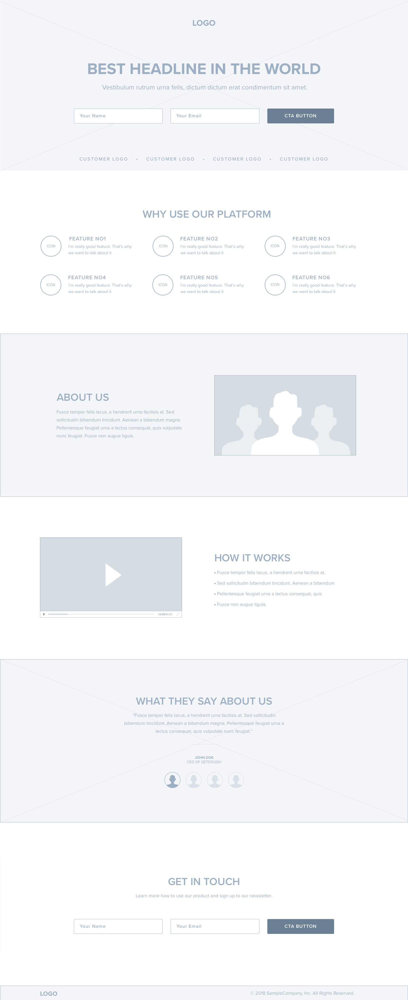

# PRD: Hydrogen Water Landing Page

## 💡 Purpose
Create a high-converting, visually clean landing page to introduce and promote **Hydrogen Water**, highlighting its health benefits, credibility, and appeal. The site should educate users, encourage email signups, and support potential future product sales.

---

## 🎯 Goals
- Communicate what hydrogen water is and why it’s valuable
- Establish trust with a clean, professional aesthetic
- Drive user engagement with a call-to-action (email signup)
- Be mobile-responsive and SEO-friendly
- Be easy to export, edit in Cursor, and deploy via Netlify

---

## 📦 Tech Stack
- HTML5
- Tailwind CSS (preferred for speed + responsiveness)
- Optional JavaScript for interactivity
- No backend (form can use Formspree or similar)
- Deploy on Netlify

---

## 🖼️ Page Layout (Based on Attached Wireframe)

### 1. Hero Section
- Large headline: “Discover the Power of Hydrogen Water”
- Subtext: 1-line elevator pitch
- Form with: Name + Email + CTA button (“Get Started”)

### 2. Trusted By (Logos)
- Placeholder customer or brand logos

### 3. Why Use Our Platform
- 6 circular icons with 1-line benefits (e.g., “More Energy”, “Cellular Repair”, “Better Recovery”)

### 4. About Us
- Left: Description text
- Right: Image or silhouette placeholder

### 5. How It Works
- Left: Video embed placeholder
- Right: Bullet list with 3–4 simplified steps

### 6. Testimonials
- Quote block with avatar and name/title

### 7. Get in Touch
- Repeat signup form with soft CTA (“Join Our Newsletter”)

### 8. Footer
- Logo + nav + copyright

---

## 🎨 Design Guidelines
- Light blue/white palette (fresh, clean, health-related)
- Rounded buttons, modern fonts (e.g., Inter or Poppins)
- Responsive layout (mobile-first)
- Clean icons, soft drop shadows, minimalistic spacing

---

## 🔗 Functionality
- Email form should submit via Formspree or other static-site-friendly method
- Buttons should be easily swappable with Shopify or Stripe later on

---

## 🧱 Deliverables
- `index.html`
- `styles.css` (or Tailwind config)
- `netlify.toml`
- `README.md`
- `assets/wireframe.jpg` (this file)

---
